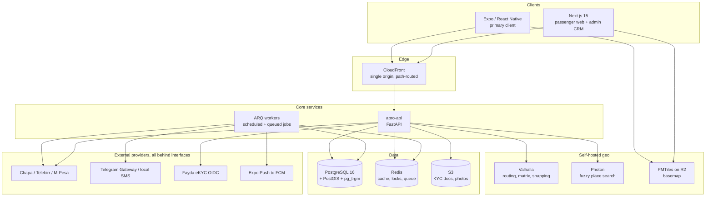

# Architecture

The intended shape of the system. None of it is built yet; each piece is delivered by its issue.

---

## System overview



## Why these choices

**PostgreSQL with PostGIS, not MongoDB.** Two reasons that are not negotiable. Bookings and
money need real transactions — a seat hold, a ledger entry and a payment intent must commit or
fail together. And the matching engine is fundamentally geometric: it stores route linestrings
and runs indexed spatial predicates against them, which is what PostGIS exists for.

**Self-hosted Valhalla, not Google Maps.** Google's licence forbids persisting route geometry,
and persisting route geometry is exactly what the matcher does. Beyond that, the Ethiopia OSM
extract is only 139 MB, so the whole routing stack runs comfortably on a 4 GB VPS at $12–24 a
month — cheaper than the API bill and with no foreign-currency payment problem, which is a real
obstacle for Ethiopian businesses. Valhalla over OSRM because it computes at request time, so
each driver's own detour tolerance works without rebuilding the graph. See
[ADR 0005](adr/0005-self-hosted-valhalla.md).

**Mobile-first.** Ethiopia is roughly 96% Android and smartphone penetration is 45%. The web app
exists for SEO route-pair landing pages, for the admin CRM, and for desktop research before
booking — but the product is the phone.

**A single CDN origin with path-based routing** keeps CORS out of the mobile client entirely, a
pattern carried over from Pokojowo where it worked well.

## Backend layering

Enforced by `import-linter` in CI, so a violation fails the build rather than getting caught in
review — or not caught.

```text
app/api/          HTTP transport only. No business logic. Thin handlers.
   ↓
app/services/     Business rules. The matching engine, pricing, the booking state machine.
   ↓
app/repositories/ Data access. All SQL lives here.
   ↓
app/models/       SQLAlchemy models.

app/core/         Config, database, logging, money, time. Imported by everything, imports nothing above.
app/integrations/ Provider adapters. Reachable only through an interface in app/services.
```

Payment and OTP adapters are specifically forbidden from being imported by `app/api` or directly
by `app/services` — they are reached through their interface. That contract is what makes the
`mock` provider work, and the `mock` provider is what lets a developer run the whole system
without an Ethiopian merchant account.

## Client layering

Both clients follow the same convention, which the ESLint boundaries plugin enforces:

```text
Component → Hook (React Query) → Service (plain functions, no React) → generated API client
```

Components never call the network. Server state never lives in `useState`. Zustand holds auth
session, UI preferences and optimistic local state, and nothing else.

## Shared TypeScript packages

| Package | Responsibility |
|---|---|
| `@abro/api-client` | Generated from the OpenAPI spec. A CI gate fails if it drifts from the spec. |
| `@abro/time` | **The only place** Ethiopian calendar and 6-hour-clock conversion may exist. |
| `@abro/i18n` | `en` and `am` catalogs. A gate enforces identical key sets. |
| `@abro/config` | Shared ESLint, Prettier and TypeScript configuration. |

## Data model, in outline

The tables that carry the most design weight:

- **`place`** — the curated meeting-point gazetteer. Amharic name, Latin transliteration, alias
  array, kind, road-snapped point geography, and a flag for access-controlled roads where a car
  physically cannot stop.
- **`trip`** — a published ride. Route stored as `geography(LineString, 4326)`, plus the driver's
  detour tolerance, seats, approval mode, and per-seat contribution in santim.
- **`trip_search`** — a denormalised read model maintained by trigger. Deliberately **not** a
  materialized view: BlaBlaCar's own load testing found concurrent refresh took two to three
  minutes and consumed the entire database.
- **`booking`** — a state machine. Seat holds are rows with expiry, not application state.
- **`ledger_entry`** — double-entry. Every santim that moves has two rows. This is the accounting
  record; the payment provider's balance is reconciled against it, not trusted over it.
- **`rating`** — carries a `revealed_at` so the 14-day blind-reveal rule is data, not a cron
  guess.

## Environments

| Environment | Purpose |
|---|---|
| Local | Docker Compose: Postgres+PostGIS, Redis, Valhalla. All providers `mock`. |
| CI | Ephemeral testcontainers Postgres. All providers `mock`. |
| Staging | Full AWS stack, provider sandboxes (Chapa test keys, Telegram test number). |
| Production | Full AWS stack, live providers. Boot fails if any provider is still `mock`. |
